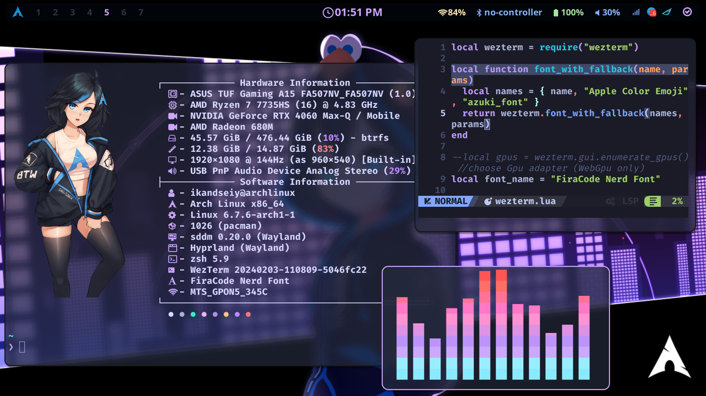

<h1 align="center">Arch Linux&Hyprland</h1>

```
              ▄▄                         ▄▄▄▄      ██     ▄▄▄▄                         
              ██              ██        ██▀▀▀      ▀▀     ▀▀██                         
         ▄███▄██   ▄████▄   ███████   ███████    ████       ██       ▄████▄   ▄▄█████▄ 
        ██▀  ▀██  ██▀  ▀██    ██        ██         ██       ██      ██▄▄▄▄██  ██▄▄▄▄ ▀ 
        ██    ██  ██    ██    ██        ██         ██       ██      ██▀▀▀▀▀▀   ▀▀▀▀██▄ 
        ▀██▄▄███  ▀██▄▄██▀    ██▄▄▄     ██      ▄▄▄██▄▄▄    ██▄▄▄   ▀██▄▄▄▄█  █▄▄▄▄▄██ 
          ▀▀▀ ▀▀    ▀▀▀▀       ▀▀▀▀     ▀▀      ▀▀▀▀▀▀▀▀     ▀▀▀▀     ▀▀▀▀▀    ▀▀▀▀▀▀  
```
<br>

## Dependencies:
- OS: [`Arch Linux`](https://archlinux.org/)
- Window Manager:[`Hyprland`](https://github.com/hyprwm/Hyprland)
- Display manager: [`Sddm`](https://github.com/sddm/sddm)
- Terminal: [`Kitty`](https://github.com/kovidgoyal/kitty)
- Status bar: [`Waybar`](https://github.com/Alexays/Waybar)
- Notifications: [`Dunst`](https://github.com/dunst-project/dunst)
- Menu: [`Rofi`](https://github.com/davatorium/rofi)
- FIle Manager: [`Ranger`](https://github.com/ranger/ranger)
- Image Viewer: [`Loupe`](https://gitlab.gnome.org/GNOME/loupe)
- Video Player: [`mpv`](https://github.com/mpv-player/mpv)
- Editor: [`Neovim`](https://github.com/neovim/neovim)
- Fetching: [`Fastfetch`](https://github.com/fastfetch-cli/fastfetch)
- Font: [`FiraCode Nerd Fonts`](https://github.com/ryanoasis/nerd-fonts/tree/master/patched-fonts/FiraCode)

#### All packages available in "packages.md" file
<br>

## Overview:




