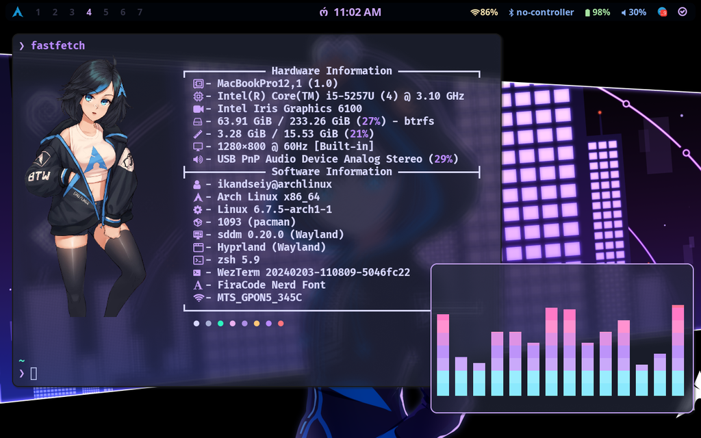

<h1 align="center">Arch Linux&Hyprland</h1>




## App list
```bash
hyprland # Tiling manager
hyprpaper # Wallpaper
neovim # Cli editor
neovim-qt # Gui version neovim
zsh # Replace bash (also install oh-my-zsh)
polkit-kde-agent # Authentication Agent
qt5-wayland # Hyprland Need
qt6-wayland # Hyprland Need
qt5ct # Hyprland Need
qt6ct # Hyprland Need
gvfs # Show Trash, Computer and other devices in thunar
gtk4 # Necessary for Chrome to use Fcitx5
noto-fonts # Pack fonts " sudo pacman -S $(pacman -Ssq 'noto-fonts-*') "
nerd-fonts # Another pack fonts
gnome-keyring # Store secrets, passwords, keys, certificates
xdg-desktop-portal-gtk # Chrome needed, choose file & upload something
xdg-desktop-portal-hyprland # Screen Sharing
cava # Audio visualizer
bluez # Bluetooth utility
firefox # Browser
dunst # Notification
nautilus # File explorer
loupe # Image viewer
ranger # Cli file explorer
sddm-git # Login manager
wezterm/kitty # Terminal
waybar # Top Bar
waybar-updates # Updates notification
fastfetch # Cli system info
brightnessctl # Screen brightness command line utils
pavucontrol # GUI pulseaudio controller
pamixer # Pulseaudio command line utils
pipewire # Audio
pipewire-pulse # Bluetooth audio support
wireplumber # Automatice choose profile
swaylock # Lockscreen
grim # Screenshot utility for Wayland
slurp # Select region for grim
rofi-lbonn-wayland # Application launcher
cliphist # Clipboard


Optional:
  tlp # Power managment
  tlpui # GUI for tlp
  intel-ucode/amd-ucode # Microcode for intel/amd laptop
  visual-studio-code-bin # Visual studio code
  telegram-desktop # Telegram
  qbittorrent # Torrent client
  duf # Cli disk free space utility
  filelight # qt gui disk space utility
  intel-media-driver # Driver for intel
  htop # Cli monitoring utility
  qping # replacement ping
  eza # replacement ls
  
```

## Arch Linux Laptop Optimization Guide For Practical Use
https://www.reddit.com/r/archlinux/comments/rz6294/arch_linux_laptop_optimization_guide_for/
